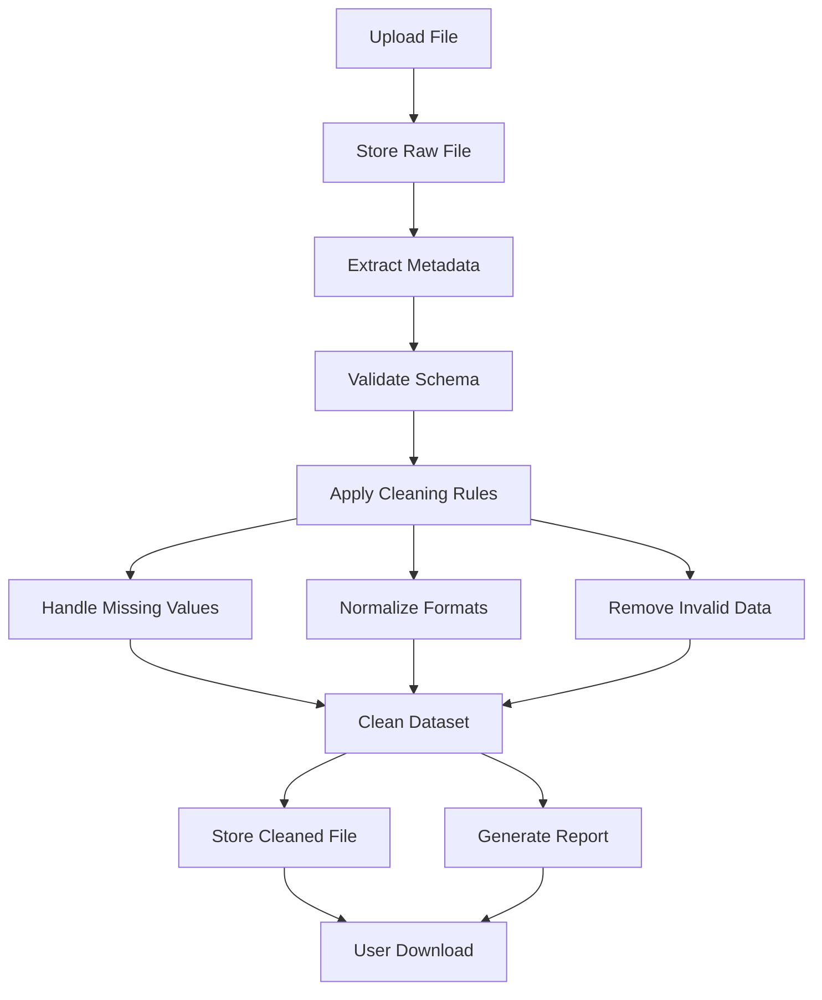
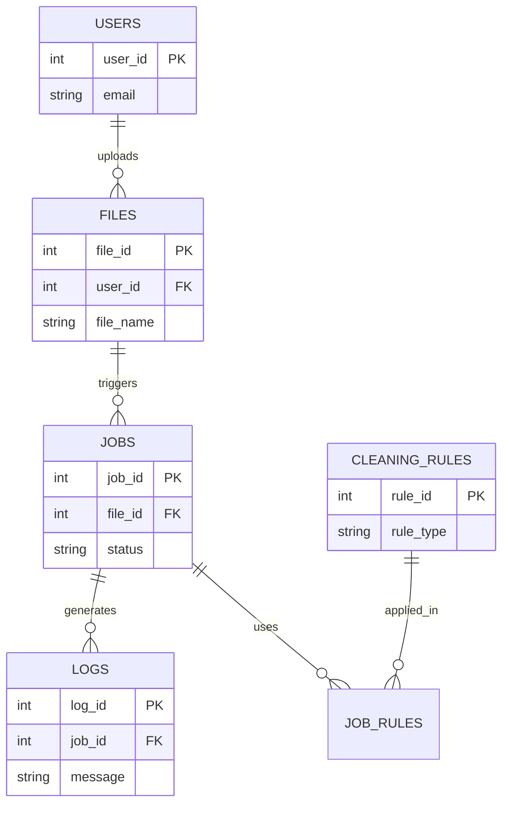

#🧼 DataCleanPro – Instantly Clean, Standardize, and Export Real-World CSV Files**


### Welcome to DataCleanPro 🧼  
DataCleanPro is a cloud-based data cleaning tool designed for real-world CSV files.  
Whether you're dealing with missing values, inconsistent dates, or currency formatting, we've got you covered.

Clean your dataset, download your results, and get back to real work — fast.
> “Clean data shouldn’t come with a dirty price tag.”

###Domain Link: https://datacleanpro.com
###Streamlit Link: https://datacleanpro.streamlit.app/

**DataCleanPro** is a friendly, affordable CSV cleaning tool built with Streamlit.

## 🚀 Features

- Strip whitespace, normalize formats, deduplicate
- Handle missing values (Pro access)
- Clean logs + download reports

## 💸 Pricing

| Rows | Cost |
|------|------|
| <=100 | Free |
| <= 500 | $0.02 |
| <= 1500 | $0.015 |
| <= 10000 | $0.01 |
| <= 25000 | $0.008 |
| <= 100000 | $0.007 |

## 🛠 Run Locally

```bash
pip install -r requirements.txt
streamlit run app.py
```

# 🚀 DataCleanPro

### Scalable Data Cleaning Platform for Analytics & AI

---

## 🏗️ Architecture Overview

```mermaid
flowchart LR
    User[User] --> UI[Streamlit UI]

    UI --> API[Python Backend API]

    API --> Storage[Cloud Storage]
    API --> MetaDB[(PostgreSQL Metadata DB)]
    API --> Queue[Job Queue (Future)]

    Queue --> Processor[Processing Engine (Pandas / Spark)]

    Processor --> Cleaned[Cleaned Data Storage]
    Processor --> Logs[Logs / Audit Trail]

    Cleaned --> UI
    Logs --> UI

    API --> Payment[Stripe API]
    API --> Email[Email Service]
```

---

## 🔁 Data Pipeline



---

## 🧱 Data Model (Metadata)



---

## 🧠 Key Features

* ✅ Automated data cleaning pipeline
* ✅ Configurable transformation rules
* ✅ Metadata tracking & audit logging
* ✅ Downloadable cleaned datasets + reports
* ✅ Scalable architecture (Pandas → Spark)

---

## 🛠️ Tech Stack

| Layer         | Technology             |
| ------------- | ---------------------- |
| UI            | Streamlit              |
| Backend       | Python                 |
| Processing    | Pandas (future: Spark) |
| Storage       | Cloud Object Storage   |
| Database      | PostgreSQL             |
| Payments      | Stripe                 |
| Notifications | Email (SMTP)           |

---

## ⚙️ Design Principles

* **Modularity** → Decoupled pipeline stages
* **Scalability** → Designed for distributed processing
* **Traceability** → Full data lineage tracking
* **Flexibility** → Rule-based transformations
* **Cost Efficiency** → Scales compute only when needed

---

## 📘 Case Study Highlights

### Problem

Messy, inconsistent datasets require manual cleaning, slowing down analytics workflows.

### Solution

A rule-based, metadata-driven platform that automates cleaning while maintaining flexibility and transparency.

### Key Trade-offs

* Simplicity (Pandas) vs scalability (Spark)
* Rule-based vs ML-driven automation
* Synchronous vs async processing

---

## 🚀 Future Enhancements

* 🔹 Distributed processing (Spark / Databricks)
* 🔹 Workflow orchestration (Airflow / Prefect)
* 🔹 ML-based cleaning recommendations
* 🔹 Feature store integration
* 🔹 Real-time processing

---

## 🎯 Why This Project Matters

This project demonstrates:

* End-to-end system design
* Data architecture thinking
* Trade-off analysis
* Scalable pipeline design
